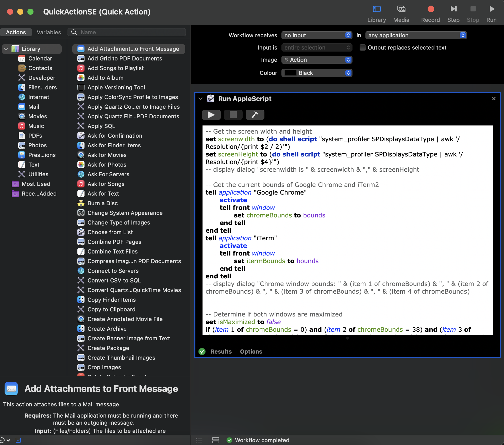
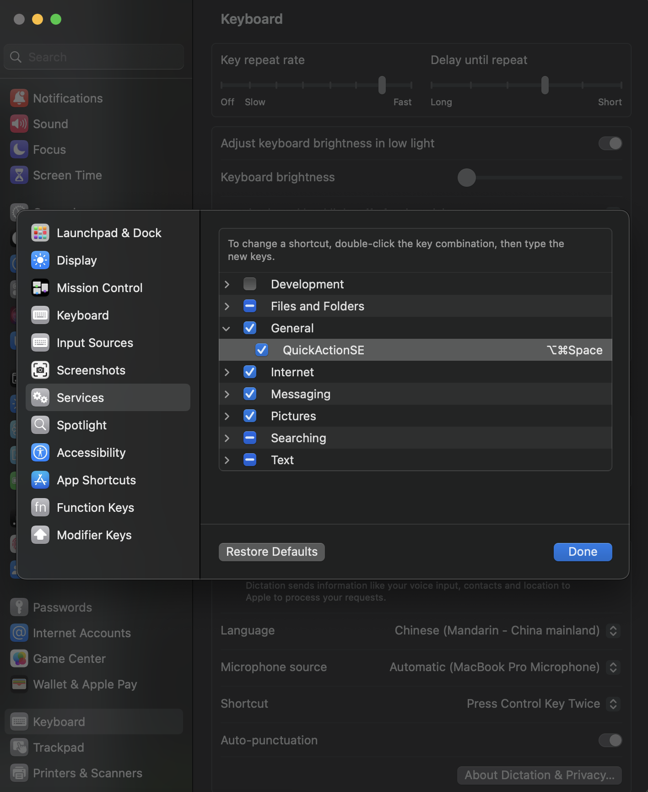

# AppleScripts

#### Now I use the QuickActionSE.scpt to resize the chrome and iterm windows. But I still keep the *resize_windows.scpt* and *recover_windows.scpt* in ***init.vim***, maybe it is more flexible.  

The QuickActionSE.scpt here is mianly used for **Automator**, so you can resize the windows of chrom and item at anytime. You can see this quick action as a good complementary tool when you are using vim and markdwon previewer. 

You can previerw the markdown files by invoking the QuickActionSE.scpt (press Shift + R), but I wanna it being done more automatically, thus I use Automator:

    
    
Figure 1 

    
    
Figure 2 

Thus, you can set a shortcut in keyboard (here I use **command+option+space**, this combination is ocupied by *show finder search window* but before so I disabled it), and then you can zoom/resize the chrom and iterm windows at anytime and anywhere you want.  
More information [this link](https://blog.csdn.net/Ming13416908424/article/details/107739236#:~:text=%E5%85%B7%E4%BD%93%E6%AD%A5%E9%AA%A4%E5%A6%82%E4%B8%8B%EF%BC%9A%201.%20%E6%89%93%E5%BC%80,%E7%9A%84%E5%BA%94%E7%94%A8%E7%A8%8B%E5%BA%8F%E6%88%96%E5%91%BD%E4%BB%A4%E3%80%82) and you can google it.

